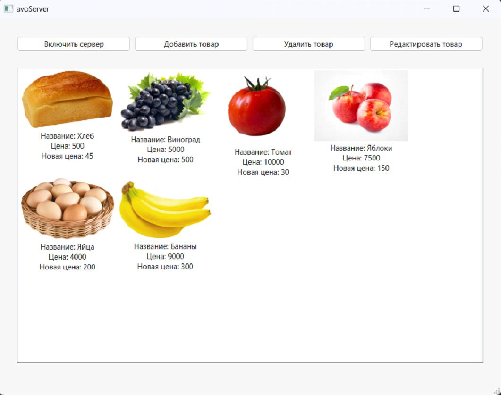

# For what?

A discount application that was written for a college degree. 
The application uses qt to render the interface, TCP to transfer images and text, 
and is written in c++. 

# How it works?

In the desktop application, you can add products (their price, 
name, discount and image), and in the mobile you can just look at them, you also have a 
QR code that does nothing, but as far as I remember it is sent from the server application, 
so you have the opportunity to refine the application and add a real bonus accumulation system 
(it is done literally in a couple of lines of code, because all user connections are in the same list)

# Desktop app

# Android app
